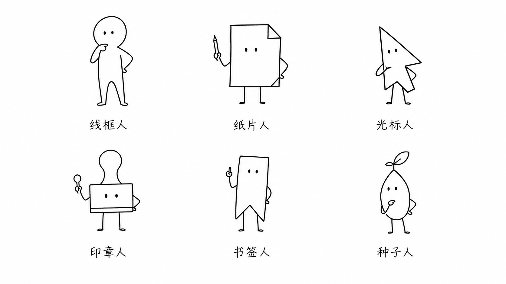
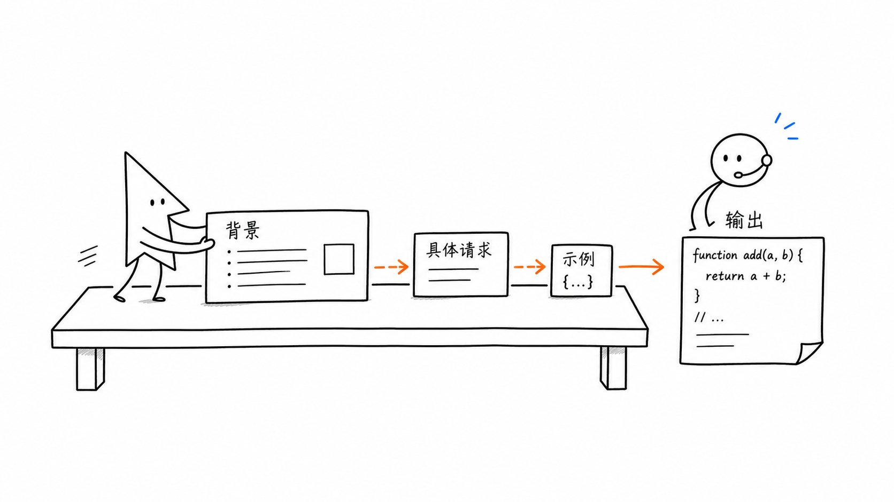
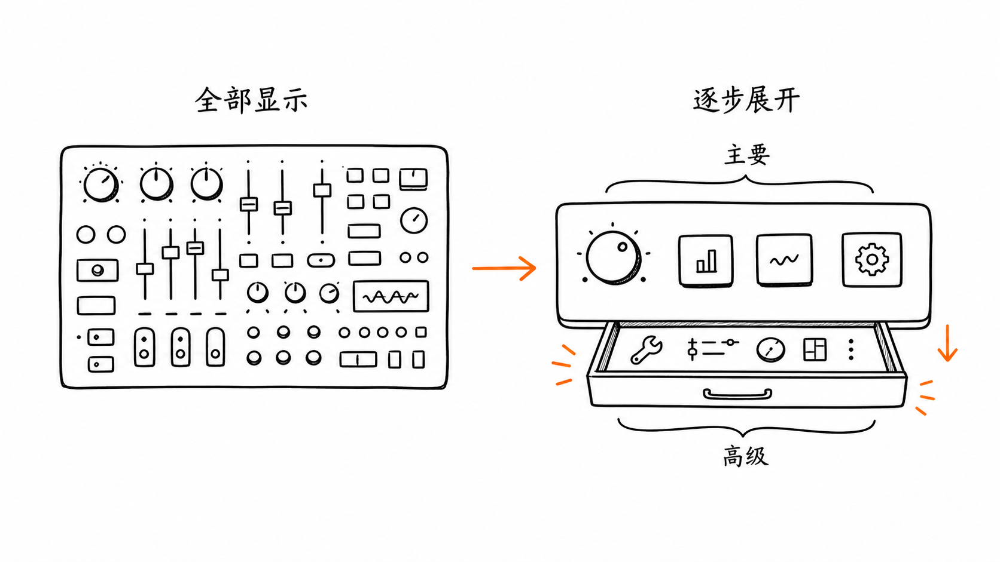
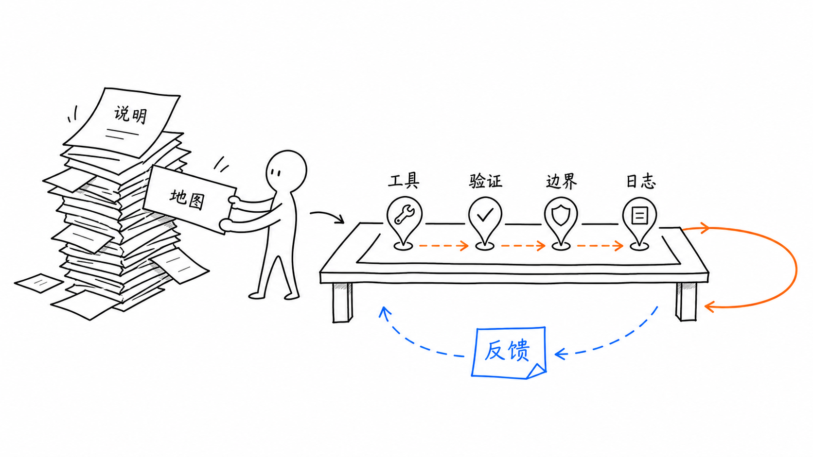

# simple-sketch-image

`simple-sketch-image` 是一个 Codex skill，用于把文章、段落、大纲、教程步骤或抽象想法，转化为简洁素描风格插图提示词，或在支持图像生成的环境中直接生成图片。

它适合内容创作者、技术博主、教程作者，以及需要稳定产出“白底、黑色手绘线稿、解释性强”的文章配图工作流的智能体。

这个 skill 最适合在 Codex 中使用；其他只支持文本的智能体，也可以参考其中的工作流和模板，生成可复制到外部生图工具里的 prompt。

## 核心能力

- 为文章封面、正文插图、教程步骤、工作流、前后对比、概念隐喻、路线图、小漫画等场景生成简笔画 prompt。
- 默认使用白底、黑色手绘线稿、大量留白，必要时加入少量强调色。
- 支持 6 个内置角色，也支持无角色图像。
- 支持用户自定义角色，例如品牌角色、个人 IP、参考图角色。
- 对中文图中文字数量做限制，降低乱码、错字和不可读风险。
- 内置 QA 检查清单，用于生成后审核和迭代。

## 安装方式

### 方式一：让 Codex 帮你安装

你可以直接把这个仓库链接发给 Codex，并说明要安装这个 skill：

```text
请帮我安装这个 Codex skill：https://github.com/atom917/simple-sketch-image
```

Codex 可以读取仓库内容，把 `simple-sketch-image/` 文件夹复制到本机的 Codex skills 目录，并在安装后帮你检查 `SKILL.md` 是否有效。

### 方式二：手动复制

把 skill 文件夹复制到 Codex skills 目录：

```powershell
Copy-Item -Recurse .\simple-sketch-image $env:USERPROFILE\.codex\skills\
```

macOS 或 Linux：

```bash
cp -R ./simple-sketch-image ~/.codex/skills/
```

然后重启 Codex，或重新加载 skills。

## 使用示例

```text
Use $simple-sketch-image to turn this paragraph into a clean 16:9 simple sketch body illustration prompt.
```

```text
Use $simple-sketch-image to plan 5 article illustrations for this Markdown draft.
```

```text
Use $simple-sketch-image with 纸片人 to create a cover prompt for an article about turning scattered notes into a knowledge system.
```

```text
Use $simple-sketch-image with no character to make a tutorial step image prompt for this workflow.
```

也可以直接中文调用：

```text
使用 $simple-sketch-image，把这篇文章规划成 4 张正文配图，并给出每张图的生图提示词。
```

```text
使用 $simple-sketch-image，用纸片人给这段内容生成一张 16:9 横版封面图 prompt。
```

## 内置角色

默认角色是 `线框人`，但 skill 不会强制每张图都使用角色。  
如果纯物件、地图、流程或图形结构更适合表达内容，就可以不使用角色。

可选内置角色：

- `线框人`：通用解释型角色，适合大多数中性说明场景。
- `纸片人`：纸片/笔记形角色，适合文章、笔记、文档、知识管理和教程。
- `光标人`：光标形角色，适合软件、AI 工具、交互流程和操作说明。
- `印章人`：印章形角色，适合审核、确认、校验、规范和流程控制。
- `书签人`：书签形角色，适合阅读、文章导航、知识库和标注场景。
- `种子人`：种子形角色，适合成长、学习、长期系统和持续改进。

你也可以提供自己的角色描述或参考图，让 skill 把它作为固定角色使用。

## 文件结构

| 文件 | 作用 |
| --- | --- |
| `simple-sketch-image/SKILL.md` | 核心 skill 定义、工作流、输出模式和参考文件路由 |
| `simple-sketch-image/agents/openai.yaml` | Codex UI 元数据 |
| `simple-sketch-image/references/visual-principles.md` | 风格规则、角色库、中文标注限制和强调色规则 |
| `simple-sketch-image/references/composition-types.md` | 封面、正文图、教程、工作流、隐喻等构图类型 |
| `simple-sketch-image/references/prompt-template.md` | 生图 prompt 模板、shot list 模板、角色插入模板和修复模板 |
| `simple-sketch-image/references/qa-checklist.md` | 生成后审核清单和迭代规则 |
| `simple-sketch-image/references/examples.md` | 正文图、封面、教程、工作流、对比、隐喻、小漫画等示例 |

## 示例效果

角色候选图：



封面图示例：基于 Atlassian 的知识管理文章，展示“散乱知识整理后才适合进入 AI 工作流”。


文章正文配图示例 1：基于 GitHub Copilot prompt engineering 文档，展示“背景、具体请求、示例、输出”的提示词工作流。



文章正文配图示例 2：基于 Nielsen Norman Group 的 Progressive Disclosure 文章，展示“先显示主要功能，再逐步展开高级功能”。



文章正文配图示例 3：基于 OpenAI 的 Harness Engineering 文章，展示“说明、地图、工具、验证、边界、日志和反馈”的 agent 工作流。



参考文章：

- [Atlassian：Why now is the knowledge management moment](https://www.atlassian.com/blog/work-management/knowledge-management-moment)
- [GitHub Docs：Prompt engineering for GitHub Copilot Chat](https://docs.github.com/en/copilot/concepts/prompting/prompt-engineering)
- [Nielsen Norman Group：Progressive Disclosure](https://www.nngroup.com/articles/progressive-disclosure/)
- [OpenAI：Harness engineering: leveraging Codex in an agent-first world](https://openai.com/index/harness-engineering/)

## 使用建议

- 不要把长段文字直接放进图片里，尽量使用短标签。
- 中文标签默认控制在 2-8 个字，正文图一般 3-6 个标签即可。
- 如果文字必须完全准确，建议先生成无文字图片，再用设计工具单独加字。
- `agents/openai.yaml` 只保存 UI 元数据；模型选择、temperature、图像 API 配置应放在调用环境里，不写进 skill。

## 许可证

MIT。详见 [LICENSE](LICENSE)。
