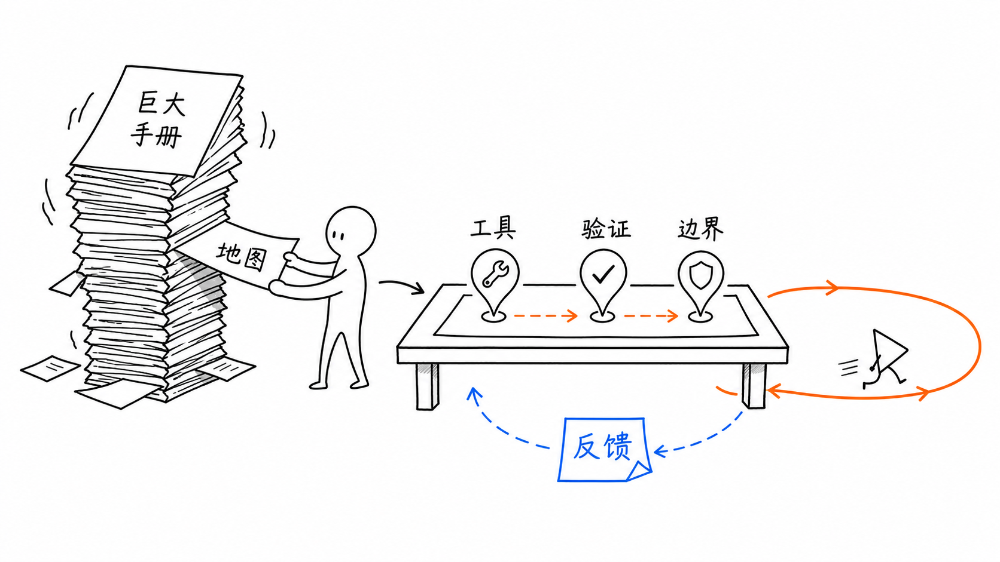

# simple-sketch-image

`simple-sketch-image` is a Codex skill for turning articles, paragraphs, outlines, tutorials, and abstract ideas into clean simple-sketch illustration prompts or generated images.

It is designed for content creators, technical bloggers, tutorial authors, and agents that need a repeatable workflow for white-background sketch illustrations with clear explanatory logic.

The skill works best with Codex, but the prompt templates and workflow can also be reused by other text-only agents to produce copy-ready image prompts for external image generation tools.

## What It Does

- Creates simple sketch prompts for article covers, body illustrations, tutorial steps, workflows, comparisons, concept metaphors, maps, and mini comics.
- Uses clean white background, black hand-drawn line art, strong whitespace, and sparse optional accent colors.
- Supports optional built-in recurring characters.
- Supports user-defined characters or no-character images.
- Limits Chinese in-image labels to reduce unreadable or garbled text.
- Includes QA rules for reviewing and iterating generated images.

## Install

Copy the skill folder into your Codex skills directory:

```powershell
Copy-Item -Recurse .\simple-sketch-image $env:USERPROFILE\.codex\skills\
```

On macOS or Linux:

```bash
cp -R ./simple-sketch-image ~/.codex/skills/
```

Restart Codex or reload skills if needed.

## Use

Example prompts:

```text
Use $simple-sketch-image to turn this paragraph into a clean 16:9 simple sketch body illustration prompt.
```

```text
Use $simple-sketch-image to plan 5 article illustrations for this Markdown draft.
```

```text
Use $simple-sketch-image with 纸片人 to create a cover prompt for an article about turning scattered notes into a knowledge system.
```

```text
Use $simple-sketch-image with no character to make a tutorial step image prompt for this workflow.
```

## Built-In Characters

The default character is `线框人`, but the skill only uses a character when it helps explain the idea.

Available characters:

- `线框人`: neutral outline helper for general explanations.
- `纸片人`: paper-note figure for articles, notes, documents, and knowledge work.
- `光标人`: cursor helper for software, AI tools, and interaction flows.
- `印章人`: stamp worker for review, approval, verification, and rules.
- `书签人`: bookmark figure for reading, navigation, and annotation.
- `种子人`: seed figure for growth, learning, and long-term systems.

You can also provide your own character description or reference and ask the skill to use it as the fixed character.

## File Structure

| File | Purpose |
| --- | --- |
| `simple-sketch-image/SKILL.md` | Core skill definition, workflow, output modes, and reference routing |
| `simple-sketch-image/agents/openai.yaml` | Codex UI metadata |
| `simple-sketch-image/references/visual-principles.md` | Style rules, character library, label limits, and accent colors |
| `simple-sketch-image/references/composition-types.md` | Composition types for covers, body images, workflows, metaphors, and more |
| `simple-sketch-image/references/prompt-template.md` | Generation prompt template, shot list template, character inserts, and repair prompts |
| `simple-sketch-image/references/qa-checklist.md` | Post-generation review and iteration rules |
| `simple-sketch-image/references/examples.md` | Reusable examples for body, cover, tutorial, workflow, comparison, metaphor, and comic prompts |

## Examples

Character candidates:


Article body illustration test:



## Notes

- Do not put long paragraphs inside generated images. Use short labels only.
- If exact text matters, generate the image without text and add text later with a deterministic design tool.
- `agents/openai.yaml` intentionally contains UI metadata only. Model selection, temperature, and image API configuration should live in the calling environment, not in this skill.

## License

MIT. See [LICENSE](LICENSE).
